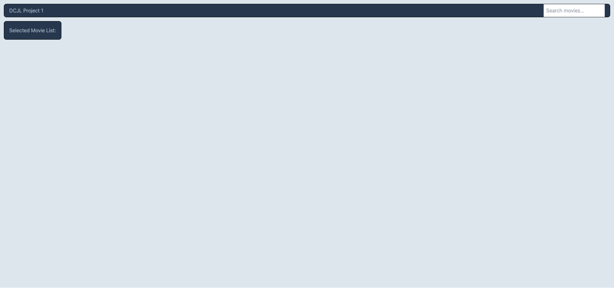

# DCJL-Project-1
Movie Review Webpage

## The Challenge

Collaborate with other developers to construct a movie review webpage that allows users to search any movie of their choosing and create a list of their top choices. This webpage will allow the user to create a list and review the description of each respective movie within their list.

Acceptance criteria for the webpage:
- When the user searches for a movie, 10 movie cards will pop up showing the movie title, year, movie poster, and a button that allows the user to add the movie to the list
- As a list is being created, the user is allowed to remove items from the list
- If the user chooses to refresh or leave the page, once the webpage is re-opened, the list will remain there
- When the user clicks on the title within the list, the user will be presented with the movie title, year, description, and a review from the NY Times

## Mock-Up

## The Process

To meet the acceptance criteria, the following had to be done:
- Research OMDb API and NY Times API and understand how each API works
- Research tailwindcss, understand functionionality, terms, and how to integrate into HTML and JS
- Apply all lessons learned within Phase 1 all together

## URL's
- Deployed: https://derricn2.github.io/DCJL-Project-1/
- GitHub: https://github.com/derricn2/DCJL-Project-1

## Sites

- [OMDb API](https://www.omdbapi.com/)
- [NY Times API](https://developer.nytimes.com/apis)
- [tailwindcss](https://tailwindcss.com/)